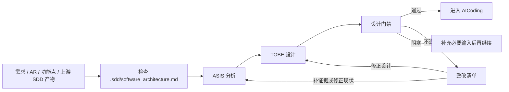

# SDD 工作流 Skills

SDD（Software Detailed Design）模块级详细设计工作流技能集，用于在 AICoding 前完成模块 ASIS 逆向分析、TOBE 目标设计和设计门禁评审。每轮模块详设产出同名前缀双文件：

- 正式《{AR编号}-{需求短名}-{模块名}模块详细设计说明书.md》：最终交付物和唯一开发依据，只由 TOBE 阶段创建或编辑。
- `{同名前缀}.context.md`：过程文档，记录 ASIS 证据、检索过程、TOBE 推导、门禁采样和复检留痕。

## 快速开始

Windows PowerShell 读取中文 skill 文件时建议显式使用 UTF-8，例如：

```powershell
$OutputEncoding = [Console]::OutputEncoding = [Text.UTF8Encoding]::new($false)
Get-Content -Raw -Encoding UTF8 .\sdd-module-detailed-design-flow\SKILL.md
```

优先使用编排 skill 串联完整流程：

```text
使用 $sdd-module-detailed-design-flow 针对 {模块名} 完成 {需求/AR/功能点} 的模块详细设计：ASIS 写 context，TOBE 写正式说明书，Gate 写 context 门禁结论，并在门禁通过后给出是否可进入 AICoding 的结论。
```

如果只需要某个阶段，也可以直接使用原子 skill：

```text
使用 $sdd-module-asis-analysis 分析 {模块名} 与 {需求/AR} 相关的 ASIS，只更新同名前缀 .context.md 中的证据、结论、边界和检索过程。
```

```text
使用 $sdd-module-tobe-design 基于 .context.md 中的 ASIS 证据设计 TOBE，按正式大纲生成或更新模块详细设计说明书。
```

```text
使用 $sdd-module-design-gate 检查正式模块详细设计说明书是否可作为唯一开发依据进入 AICoding。
```

## Skill 概览

| Skill | 何时使用 | 主要输出 |
|-------|----------|----------|
| `sdd-module-detailed-design-flow` | 需要完整串联 ASIS、TOBE、Gate，或进行演练验证时 | ASIS context、正式说明书、门禁 context 结论 |
| `sdd-module-asis-analysis` | 需要用代码证据确认现状、边界、隐藏约束、风险和测试覆盖时 | `.context.md` 中的 ASIS 结论、证据索引和过程 |
| `sdd-module-tobe-design` | 已有 ASIS context，需要设计可直接指导 AICoding 的目标方案时 | 按正式大纲生成/更新说明书，并补充 TOBE 推导 context |
| `sdd-module-design-gate` | 需要判断正式说明书是否能进入 AICoding，或门禁不通过后复检时 | `.context.md` 中的通过/不通过/阻塞结论、四链摘要、阻断问题和整改清单 |

## 工作流程



门禁围绕四条链判断质量，而不是检查章节是否写满：

- 证据链：需求/AR -> ASIS 证据 -> TOBE 决策。
- 边界链：模块边界 -> 职责分配 -> 交互约束。
- 执行链：TOBE 决策 -> AICoding 任务 -> 最小验证集。
- 风险链：触发风险 -> 缓解设计 -> 验证/回退。

## 关键约束

- ASIS 必须且只能使用当前工作区 `.sdd/software_architecture.md` 作为模块边界来源。该文件缺失、不可读、目标模块缺失、声明含糊或与用户指定模块冲突时，中断 ASIS，并停止依赖该边界的 TOBE 和门禁流程。
- 检查 `.sdd/software_architecture.md` 时先读取直接路径；若使用 `rg` 枚举隐藏目录，使用 `rg --files -uu .sdd`，不要用裸 `rg --files` 的空结果判定 `.sdd` 缺失。
- 仓库根目录、子目录中的 `software_architecture.md`，以及 `softWare.md`、`software.md`、README 或代码结构推断，都不能替代 `.sdd/software_architecture.md`。
- 演练模式需要落盘且未指定路径时，默认使用 `.sdd/AR-SDD-TRIAL-...` 或外部 `sdd-trial-output/`，不得复用真实 AR 成果物，也不得覆盖未跟踪或他人正在编辑的 `.sdd` 文件。
- ASIS 阶段只写 `.context.md`，不得创建或编辑正式说明书。
- TOBE 阶段是正式说明书唯一写入者，必须按 9 个一级章节组织正式说明书；第 8 章“模块详细方案”必须按需求点展开，不能只用总表替代正文。
- Gate 阶段只读正式说明书和 `.context.md`，门禁结论、阻断问题和整改清单写入 `.context.md` 或在当前会话返回，不编辑正式说明书正文。
- 正式说明书是唯一开发依据。任何会影响编码实现、接口契约、包/类设计、数据库、配置、调用流程、验证方式、风险控制或回退策略的内容，都必须由 TOBE 阶段写入正式说明书。
- `.context.md` 只保留证据、检索过程、推导、替代方案、采样和复检记录。开发必需内容只存在于 `.context.md` 时，门禁必须判定正式说明书不通过。
- 更新已有成果物前必须读取当前内容，只替换本阶段负责的章节或明确占位区域，避免覆盖其他阶段或人工补充内容。

## 目录结构

```text
sdd-workflow-skills/
  README.md
  sdd-module-design-method.md          # 编排流程使用的共享方法论
  sdd-module-asis-analysis/
    SKILL.md                           # ASIS 阶段规则
    agents/openai.yaml                 # Agent 接口配置
    references/asis-output-template.md # ASIS context 模板
    references/evidence-checklist.md   # 证据挖掘清单
  sdd-module-tobe-design/
    SKILL.md                           # TOBE 阶段规则
    agents/openai.yaml                 # Agent 接口配置
    references/tobe-output-template.md # 正式说明书 TOBE 模板
    references/aicoding-task-template.md
  sdd-module-design-gate/
    SKILL.md                           # 门禁阶段规则
    agents/openai.yaml                 # Agent 接口配置
    references/gate-result-template.md # 门禁 context 模板
    references/gate-checklist.md       # 可选检查清单
  sdd-module-detailed-design-flow/
    SKILL.md                           # 轻量编排流程
    agents/openai.yaml                 # Agent 接口配置
    references/flow-summary.md         # 流程摘要
  docs/presentations/
    sdd-methodology-huawei-style/      # 方法论演示材料
```

## 核心概念

- **正式说明书**：`{AR编号}-{需求短名}-{模块名}模块详细设计说明书.md`，最终交付和唯一开发依据。
- **context 文件**：`{AR编号}-{需求短名}-{模块名}模块详细设计说明书.context.md`，记录 ASIS 证据、TOBE 推导、门禁采样和复检。
- **ASIS**：基于代码证据的现状分析，只确认事实、推断和不确定性，不提前设计 TOBE。
- **TOBE**：基于 ASIS context 和模块边界的目标设计，是正式说明书唯一写入阶段，必须落到工程位置、任务、验收标准和最小验证集。
- **设计门禁**：判断正式说明书是否能作为唯一开发依据进入 AICoding，并在 context 或当前会话输出整改或阻塞结论。
- **AICoding**：门禁通过后的自动化编码实施阶段。

## 使用方式

这些 skill 适用于支持 skill 接口格式的 AI 编码 Agent（如 Codex、Cursor 等）。将本仓库中的 skill 目录安装到 Agent 的 skills 目录后，即可通过 `$sdd-module-...` 名称调用。

推荐优先从 `$sdd-module-detailed-design-flow` 开始；当已有正式说明书且只需要补齐某个阶段时，再单独调用 ASIS、TOBE 或 Gate 原子 skill。

## 许可证

MIT
