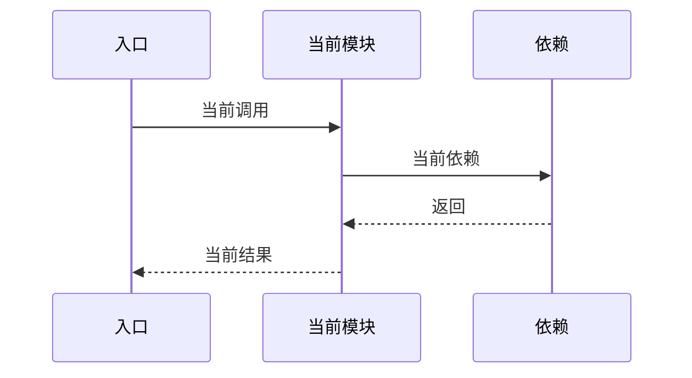

# 模块详细设计 ASIS context 模板

ASIS 阶段只更新同名前缀 `.context.md`，不创建、不编辑、不覆盖正式《{AR编号}-{需求短名}-{模块名}模块详细设计说明书.md》。正式说明书只能由 TOBE 阶段基于本 context 中的证据和结论生成。

本模板用于记录 ASIS 证据、检索过程、边界确认、调用链展开、测试覆盖和阻塞项。所有会影响 TOBE、AICoding、验证或风险判断的 ASIS 结论，都必须在 `.context.md` 中有稳定编号和证据编号，供 TOBE 阶段引用进正式说明书。

## C1. ASIS 分析结论摘要

| 项目 | 内容 |
|---|---|
| 本次需求/AR/变更点 |  |
| 目标模块 |  |
| 仓库范围 |  |
| 模块边界来源 | `.sdd/software_architecture.md` |
| 边界来源类型 | declared / blocked |
| 本次 ASIS 分析范围 | 需求相关切片 / 完整模块 |
| 是否启用小模块模式 | 否 / 是，原因： |
| 是否发生范围扩展 | 否 / 是，原因： |
| ASIS 状态 | 完成 / 部分完成 / 阻塞 |
| 分析置信度 | 高 / 中 / 低 |
| 主要风险 |  |
| 阻塞或待确认项 |  |
| 后续 TOBE 可引用结论 | A1 / A2 / ... |

当分析置信度为 `低`，或关键结论依赖 `推断/待确认` 时，必须在“待确认问题”或“ASIS 阻塞项”中记录影响和所需输入，不能只在摘要区标记低置信度后继续流转。

## C2. 完整需求/AR 与 ASIS 证据映射

| 编号 | 需求/AR/功能点/影响点 | 本模块相关性 | 现有入口/代码区域/数据对象/配置/交互 | ASIS 结论编号 | ASIS 结论 | 证据编号 | 覆盖状态 | 未覆盖或待确认原因 |
|---|---|---|---|---|---|---|---|---|
| R1 |  | 需求相关 / 疑似相关 / 不涉及本模块 |  | A1 | 事实 / 推断 / 待确认： | E1 | 已覆盖 / 部分覆盖 / 待确认 / 不涉及本模块 |  |

## C3. 边界确认记录

| 来源 | 发现 | 置信度 | 影响 |
|---|---|---|---|
| `.sdd/software_architecture.md` |  | 高 / 中 / 低 |  |

### C3.1 模块边界

| 分类 | 路径或组件 | 判断依据 | 证据编号 |
|---|---|---|---|
| 确定属于模块 |  |  | E1 |
| 疑似属于模块 |  |  | E1 |
| 外部依赖 |  |  | E1 |

说明 `.sdd/software_architecture.md` 如何记录该模块。如果 `.sdd/software_architecture.md` 缺失、不可读、目标模块缺失或声明含糊，写入 ASIS 阻塞项并中断；不得用代码结构或其他架构文档推断边界。

### C3.2 本次需求相关分析范围

| 分类 | 路径、组件或行为 | 纳入/排除原因 | 证据编号 |
|---|---|---|---|
| 需求相关 |  |  | E1 |
| 疑似相关 |  |  | E1 |
| 本次不分析 |  |  | E1 |

说明为什么 ASIS 限定在该切片内，或为什么必须扩展为完整模块分析。

## C4. 关键 ASIS 事实

只列会影响 TOBE 决策、工程落点、接口、数据库、任务拆分、验证或风险控制的事实、推断或待确认项。

| ASIS 结论编号 | 关键现状结论 | 类型 | 对 TOBE/AICoding 的影响 | 证据编号 | 备注 |
|---|---|---|---|---|---|
| A1 |  | 事实 / 推断 / 待确认 / 阻塞相关 |  | E1 |  |

## C5. 关键调用链或数据流

| 链路/数据对象 | 当前行为 | 与本次需求/变更的关系 | 对 TOBE 的约束 | 证据编号 |
|---|---|---|---|---|
|  |  |  |  | E1 |

### C5.1 现状流程图或时序图

涉及多入口、多组件协作、跨模块交互、状态变化、写后读、异常路径或回滚时必须提供。简单单函数变更可写明不适用原因。

## C6. 隐藏约束、规格漂移与风险

| 编号 | 类型 | 现状/漂移/风险 | 影响 | 后续设计关注点 | 证据编号 |
|---|---|---|---|---|---|
| A1 | 兼容 / 历史 / 性能 / 数据 / 安全 / 运维 / 测试 / 规格漂移 |  |  |  | E1 |

## C7. 测试覆盖现状

| 测试文件或套件 | 覆盖行为 | 与本次需求/变更的关系 | 未覆盖风险 | 证据编号 |
|---|---|---|---|---|
|  |  |  |  | E1 |

## C8. 配置、异常、事务、并发、幂等细节

| 主题 | ASIS 行为 | 风险或限制 | 与本次需求/变更的关系 | 证据编号 |
|---|---|---|---|---|
| 参数校验 / 权限 / 异常 / 事务 / 并发 / 幂等 / 重试 / 降级 |  |  |  | E1 |

## C9. ASIS 阻塞项

仅当 ASIS 状态为 `阻塞` 或 `部分完成` 时填写。

| 阻塞项 | 阻塞原因 | 已完成分析范围 | 不能确认的结论 | 需要补充的输入 | 对 TOBE/AICoding 的影响 |
|---|---|---|---|---|---|
|  |  |  |  |  |  |

## C10. 待确认问题

| 问题 | 类型 | 为什么影响 TOBE/AICoding | 当前线索 | 建议确认对象 |
|---|---|---|---|---|
|  | 需前置确认 / 普通待确认 |  |  | 用户 / 代码负责人 / 上游设计 / 运行环境 |

## C11. 代码检索过程

| 步骤 | 查询/文件 | 目的 | 结果摘要 |
|---|---|---|---|
|  |  |  |  |

## C12. 详细代码结构、调用链与数据流

| 区域 | 关键文件或包 | 作用 | 与本次需求/变更的关系 | 证据编号 |
|---|---|---|---|---|
| 入口层 / 应用层 / 领域层 / 数据访问 / 外部适配 / 配置 / 测试 |  |  |  | E1 |

## C13. 证据索引

| 编号 | 证据类型 | 位置 | 支撑结论 |
|---|---|---|---|
| E1 | 文件 / 行号 / 函数 / 类 / 测试 / 配置 / 迁移 / 文档 | `path:line` | A1 |
