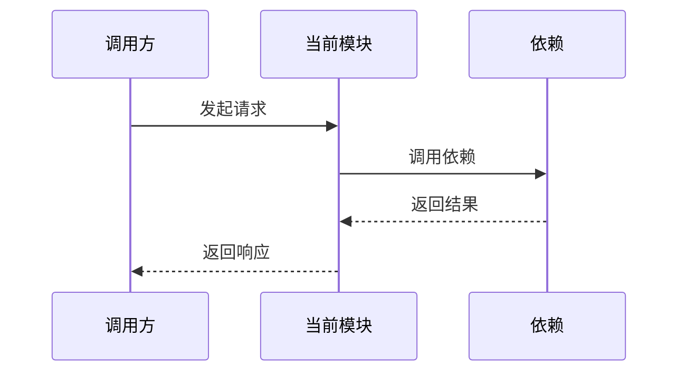

# 模块详细设计说明书 TOBE 正式模板

使用本模板更新当前 SDD 工作流指定的正式《{AR编号}-{需求短名}-{模块名}模块详细设计说明书.md》。正式说明书是指导后续 AICoding 拆分的设计依据；只有 TOBE 阶段可以编辑正式说明书正文。ASIS 和 Gate 阶段只写同名前缀 `.context.md` 或返回检查结论，测试用例由独立测试设计阶段生成。

TOBE 必须基于 `.context.md` 中的 ASIS 证据形成设计，不得脱离证据凭空设计。正式说明书是面向用户、评审和开发的标准交付件，只呈现设计结论、现状约束摘要、接口契约、模块边界、实现方案、风险、可测试性输入和待确认事项；不得写入 ASIS 检索过程、证据编号表、推导过程、反证记录、门禁采样、追踪矩阵等过程性内容。`.context.md` 只记录证据、推导和过程，不参与后续开发指导。

一级标题遵循本模板。未涉及的章节保留标题并写明“不涉及，原因：...”，不要生成大量空表。第 8 章是后续 AICoding 拆分的核心设计依据，必须按需求点展开，不能只用一个总表替代正文。

# {AR编号}-{需求短名}-{模块名}模块详细设计说明书

## 1. 需求背景 / 当前 AR 描述

### 1.1 需求与目标

说明需求背景、当前 AR、目标行为、触发条件和验收口径。

### 1.2 范围说明

说明本模块负责什么、不负责什么，以及影响本次设计的关键现状约束。现状约束用用户可读语言概括，不写 ASIS 结论编号、证据编号或检索过程。

| 编号 | 需求/AR/变更点 | 本模块处理结论 | 现状约束摘要 | 关联详细方案 |
|---|---|---|---|---|
| R1 |  | 本模块实现 / 本模块配合 / 不属于本模块 / 待确认 |  | 8.1 |

### 1.3 关键契约清单

列出本次设计必须保持或新增的开发契约。下表中的每一项都必须在正式说明书后续章节中可直接反查，并能支撑后续测试设计和编码任务拆分；不得只写“见上文”“按原定义”“新增接口”等概要。

| 契约编号 | 契约类型 | 名称 / 签名 / Path / Topic | 关键内容 | 适用章节 | 可测试性关注点 |
|---|---|---|---|---|---|
| K1 | REST / RPC / MQ / Method / DTO / Field / ErrorCode / Config / SQL |  | method、path、函数签名、入参、出参、字段名、JSON 名称、错误码、状态值、单位、默认值等 | 3 / 7 / 8.1.4 / 8.1.9 | 主路径 / 失败路径 / 兼容 / 日志观测 |

## 2. 外部依赖

说明本次涉及的上游、下游、三方系统、中间件、配置、开关、环境依赖。

| 依赖对象 | 类型 | 当前关系 | 本次变化 | 兼容 / 风险说明 |
|---|---|---|---|---|
|  | 上游 / 下游 / 三方系统 / 中间件 / 配置 / 环境 |  | 新增 / 修改 / 不变 / 移除 |  |

## 3. 对外接口

说明本模块对外暴露或消费的接口变化；没有变化时写明“不涉及，原因：...”。

| 接口编号 | 接口类型 | Method / Topic / Path / 名称 | 调用方 | 提供方 | 请求 / 消息结构 | 响应 / 返回结构 | 错误码 / 状态值 | 本次变化 | 兼容策略 | 关联契约 |
|---|---|---|---|---|---|---|---|---|---|---|
| API1 | REST / RPC / MQ / Kafka / 文件 / 批处理 / 定时任务 |  |  |  | 字段名、类型、必填、JSON 名称、单位 | 字段名、类型、JSON 名称、单位 |  | 新增 / 修改 / 不变 / 移除 |  | K1 |

如果存在对外接口变化，必须补充请求、响应、错误码、消息结构或示例。接口契约必须能支撑 AICoding 实现和测试；如果上文已经明确给出契约，必须完整承接，不得省略字段或改写名称。

## 4. 整体方案

### 4.1 方案概述

说明总体设计思路、关键设计决策、兼容/灰度/回退策略。

| 决策编号 | 设计点 | 设计结论 | 设计依据摘要 | 影响范围 | 状态 / 待确认说明 |
|---|---|---|---|---|---|
| D1 |  |  |  | 文件 / 组件 / 接口 / 数据 / 配置 | 已定稿 / 需前置确认： |

### 4.2 流程与时序

涉及多组件协作、跨模块交互、状态变化、异步、回滚或异常路径时补充 Mermaid 流程图或时序图。简单单函数变更可写明不适用原因。

## 5. 数据库 / 表设计

说明表、字段、索引、约束、迁移、回填、兼容和回滚变化；没有变化时写明“不涉及，原因：...”。

| 对象 | 变化类型 | 变化内容 | 兼容策略 | 回滚策略 |
|---|---|---|---|---|
| 表 / 字段 / 索引 / 约束 / 迁移脚本 | 新增 / 修改 / 删除 / 不变 |  |  |  |

## 6. 受影响模块

说明当前模块和相关模块的职责边界、影响范围、是否本次修改。

| 模块 | 职责 | 影响类型 | 本次是否修改 | 边界说明 |
|---|---|---|---|---|
|  |  | 直接修改 / 间接影响 / 仅依赖 / 不涉及 | 是 / 否 |  |

## 7. 模块交互设计

说明模块之间的调用关系、数据流、状态流转、异常/重试/补偿、防腐层或 DTO 转换。必要时补充模块交互图。

| 交互编号 | 发起方 | 接收方 | 交互方式 | 数据 / DTO | 异常与重试 | 防腐 / 隔离说明 |
|---|---|---|---|---|---|---|
| I1 |  |  | REST / RPC / MQ / 直接调用 / 文件 / 数据库 |  |  |  |

## 8. 模块详细方案

### 8.1 {需求点 / 功能点名称}

#### 8.1.1 需求描述

说明该需求点要解决的问题、目标行为、触发条件、输入输出和验收口径。

#### 8.1.2 现状约束摘要

说明当前行为、现有限制、隐藏约束或待确认项对本需求点的影响。内容面向用户和开发者阅读，不写 ASIS 结论编号、证据编号或检索过程。

| 约束项 | 类型 | 对本需求点的影响 | 处理方式 |
|---|---|---|---|
|  | 当前行为 / 现有限制 / 隐藏约束 / 待确认 / 阻塞 |  | 设计承接 / 前置确认 / 暂不定稿 |

#### 8.1.3 TOBE 设计说明

说明目标设计、核心处理逻辑、关键设计决策、为什么这样设计，以及与 ASIS 的差异。

#### 8.1.4 类 / 接口 / 数据结构变化

说明新增、修改或废弃的类、接口、DTO、枚举、字段、方法签名等。若上文已经明确给出接口定义、函数/方法签名、DTO 字段或 JSON 示例，必须在本节完整承接并标注关联契约编号。必要时补充类图或结构表。

| 对象 | 类型 | 变化 | 完整签名 / 字段定义 | 入参 | 出参 / 返回值 | 异常 / 错误码 | 职责 / 语义 | 关联契约 |
|---|---|---|---|---|---|---|---|---|
|  | Class / Interface / DTO / Enum / Method / Function / Field | 新增 / 修改 / 废弃 / 不变 | 例如 `func Name(ctx context.Context, req Request) (Response, error)` / `jsonField: string` | 名称、类型、必填、单位、默认值 | 名称、类型、单位、序列化名称 |  |  | K1 |

#### 8.1.5 处理流程

说明主流程。涉及多步骤、多组件、跨模块、异步或状态变化时必须补充 Mermaid 流程图或时序图。

#### 8.1.6 异常、回退与边界场景

说明异常输入、依赖失败、部分成功、重复请求、重试、补偿、回滚、幂等和兼容行为。

#### 8.1.7 配置、开关与环境差异

说明配置项、默认值、灰度方式、关闭后的行为，以及不同环境下的差异。不涉及时写明原因。

#### 8.1.8 日志与可观测性

说明关键日志、指标、告警、链路追踪、错误定位方式，以及敏感信息处理。

#### 8.1.9 可测试性与验收口径

说明该需求点后续测试设计必须覆盖的目标行为、边界条件、失败路径、兼容/回归要求、风险验证点和可观察信号。本节只提供测试设计输入，不生成测试用例编号、建议测试文件、测试命令、Fixture、Mock 或断言清单。

| 验证目标 | 覆盖范围 | 输入 / 触发条件 | 预期行为 | 可观察信号 | 关联契约 / 设计点 |
|---|---|---|---|---|---|
| 主路径 / 边界 / 失败路径 / 兼容回归 / 安全 / 性能 / 迁移 / 日志观测 |  |  |  | 返回值 / 状态变化 / 数据副作用 / 日志 / 指标 / 告警 | K1 / D1 |

编码任务拆分不在 TOBE 阶段生成；后续 AICoding 流程应基于本说明书中的工程落点、契约和可测试性输入另行拆分。

### 8.2 {需求点 / 功能点名称}

按 8.1 相同结构展开。没有多个需求点时不创建空小节。

## 9. 附录 / 三方件约束

记录三方件版本、框架/SDK 约束、安全/权限/合规、性能/SLA、已知限制、待确认问题、术语表等。

| 主题 | 内容 | 影响 | 处理方式 |
|---|---|---|---|
| 三方件 / 框架 / SDK / 安全 / 权限 / 合规 / 性能 / SLA / 已知限制 / 待确认 / 术语 |  |  |  |
