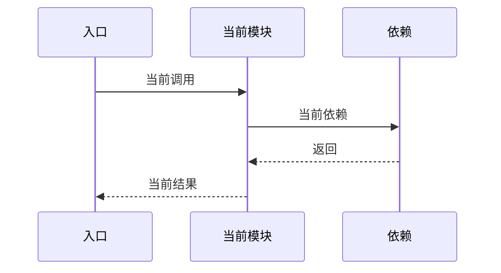

# 模块详细设计说明书 ASIS 章节模板

更新当前 SDD 工作流指定的模块详细设计类成果物时使用本模板；如果工作流未指定，默认用于 `xxx模块详细设计说明书`。默认范围是模块中与当前需求、AR 项、功能点、影响范围或计划变更相关的部分。保留实际相关的章节；如果某个章节没有可验证内容，写明 `未发现` 或 `待确认`，并说明原因。

小范围变更或小模块模式可以合并章节，但至少保留：分析结论摘要、边界来源与推断依据、需求/AR 与 ASIS 证据映射、模块边界与本次分析切片、关键 ASIS 事实、隐藏约束与风险、规格漂移、测试覆盖现状、待确认问题、证据索引。不要为了套完整模板而生成大量空表。

## 1. 分析结论摘要

| 项目 | 内容 |
|---|---|
| 本次需求/AR/变更点 |  |
| 目标模块 |  |
| 仓库范围 |  |
| 运行模式 | 真实 / 演练 |
| 模块边界来源 | `softWare.md` / 推断 / 用户指定 |
| 边界来源类型 | declared / inferred / mixed |
| 边界推断依据 | 包/目录结构 / import 与反向调用链 / 测试 / 配置/构建文件 / README/架构文档 |
| 本次 ASIS 分析范围 | 需求相关切片 / 完整模块 |
| 是否启用小模块模式 | 否 / 是，原因： |
| 是否发生范围扩展 | 否 / 是，原因： |
| ASIS 状态 | 完成 / 部分完成 / 阻塞 |
| 分析置信度 | 高 / 中 / 低 |
| 主要风险 |  |
| 阻塞或待确认项 |  |

> 说明：当分析置信度为 `低`，或关键结论依赖 `推断/待确认` 时，必须在“待确认问题”或“ASIS 阻塞项”中记录影响和所需输入，不能只在摘要区标记低置信度后继续流转。

## 2. 需求/AR 与 ASIS 证据映射

| 编号 | 需求/AR/功能点/影响点 | 本模块相关性 | 现有入口/代码区域/数据对象/配置/交互 | ASIS 结论编号 | ASIS 结论 | 证据编号 | 覆盖状态 | 未覆盖或待确认原因 |
|---|---|---|---|---|---|---|---|---|
| R1 |  | 需求相关 / 疑似相关 / 不涉及本模块 |  | A1 | 事实 / 推断 / 待确认： | E1 | 已覆盖 / 部分覆盖 / 待确认 / 不涉及本模块 |  |

## 3. 模块边界与本次分析切片

### 3.1 模块边界

| 分类 | 路径或组件 | 判断依据 | 证据 |
|---|---|---|---|
| 确定属于模块 |  |  |  |
| 疑似属于模块 |  |  |  |
| 外部依赖 |  |  |  |

说明 `softWare.md` 如何记录该模块。如果 `softWare.md` 缺失、疑似过期或含糊，说明采用了什么替代推断方式。

### 3.2 本次需求相关分析范围

| 分类 | 路径、组件或行为 | 纳入/排除原因 | 证据 |
|---|---|---|---|
| 需求相关 |  |  |  |
| 疑似相关 |  |  |  |
| 本次不分析 |  |  |  |

说明为什么 ASIS 限定在该切片内，或为什么必须扩展为完整模块分析。

## 4. 当前职责

列出需求相关区域当前承担的职责，且只记录 ASIS 事实、推断或待确认项。

| ASIS 结论编号 | 职责 | 类型 | 与本次需求/变更的关系 | 证据 | 备注 |
|---|---|---|---|---|---|
| A1 |  | 事实 / 推断 / 待确认 |  | E1 |  |

## 5. 代码结构

| 区域 | 关键文件或包 | 作用 | 与本次需求/变更的关系 | 证据 |
|---|---|---|---|---|
| 入口层 |  |  |  |  |
| 应用/服务层 |  |  |  |  |
| 领域/规则层 |  |  |  |  |
| 数据访问层 |  |  |  |  |
| 外部适配层 |  |  |  |  |
| 配置/启动 |  |  |  |  |
| 测试 |  |  |  |  |

## 6. 入口与调用链

对分析切片中的每个重要入口分别记录：

### 6.x 入口名称

| 项目 | 内容 |
|---|---|
| 入口类型 | API / Job / Consumer / CLI / Listener / Other |
| 入口位置 |  |
| 与本次需求/变更的关系 |  |
| 主调用链 |  |
| 主要输入 |  |
| 主要输出 |  |
| 主要副作用 |  |
| 证据 |  |

## 7. 数据流与状态变化

| 数据对象 | 来源 | 处理过程 | 落点或输出 | 约束 | 与本次需求/变更的关系 | 证据 |
|---|---|---|---|---|---|---|
|  |  |  |  |  |  |  |

按需包含数据库表、缓存 Key、消息载荷、文件、DTO、实体和序列化格式。

### 7.1 现状流程图或时序图

涉及多入口、多组件协作、跨模块交互、状态变化、写后读、异常路径或回滚时必须提供。简单单函数变更可写明不适用原因。

## 8. 外部依赖

| 依赖 | 类型 | 调用位置 | 用途 | 失败处理 | 与本次需求/变更的关系 | 证据 |
|---|---|---|---|---|---|---|
|  | DB / Cache / MQ / RPC / HTTP / SDK / File / Config / Auth |  |  |  |  |  |

## 9. 配置、开关与环境差异

| 配置或开关 | 默认值 | 使用位置 | 环境差异 | 影响 | 与本次需求/变更的关系 | 证据 |
|---|---|---|---|---|---|---|
|  |  |  |  |  |  |  |

## 10. 异常、事务、并发与幂等

| 主题 | ASIS 行为 | 风险或限制 | 与本次需求/变更的关系 | 证据 |
|---|---|---|---|---|
| 参数校验 |  |  |  |  |
| 权限与鉴权 |  |  |  |  |
| 异常处理 |  |  |  |  |
| 事务 |  |  |  |  |
| 并发控制 |  |  |  |  |
| 幂等 |  |  |  |  |
| 重试与超时 |  |  |  |  |
| 降级与回滚 |  |  |  |  |

## 11. 隐藏约束与历史包袱

| 约束 | 类型 | 影响 | 与本次需求/变更的关系 | 证据 | 置信度 |
|---|---|---|---|---|---|
|  | 兼容 / 历史 / 性能 / 数据 / 安全 / 运维 / 测试 |  |  |  | 高 / 中 / 低 |

## 12. 规格漂移

记录设计文档、README、注释、测试与代码实现之间影响本次需求的差异。

| 漂移项 | 文档/设计描述 | 代码/测试现状 | 影响 | 证据 | TOBE 关注点 |
|---|---|---|---|---|---|
|  |  |  |  | E1 / E2 |  |

## 13. 测试覆盖现状

| 测试文件或套件 | 覆盖行为 | 与本次需求/变更的关系 | 未覆盖风险 | 证据 |
|---|---|---|---|---|
|  |  |  |  |  |

## 14. 已知问题与风险

| ASIS 结论编号 | 风险 | 影响范围 | 触发条件 | 严重度 | 证据 | 后续设计关注点 |
|---|---|---|---|---|---|---|
| A1 |  |  |  | 高 / 中 / 低 | E1 |  |

## 15. ASIS 阻塞项

仅当 ASIS 状态为 `阻塞` 或 `部分完成` 时填写。

| 阻塞项 | 阻塞原因 | 已完成分析范围 | 不能确认的结论 | 需要补充的输入 | 对 TOBE/AICoding 的影响 |
|---|---|---|---|---|---|
|  |  |  |  |  |  |

## 16. 待确认问题

| 问题 | 类型 | 为什么影响 TOBE/AICoding | 当前线索 | 建议确认对象 |
|---|---|---|---|---|
|  | 需前置确认 / 普通待确认 |  |  | 用户 / 代码负责人 / 上游设计 / 运行环境 |

## 17. 证据索引

| 编号 | 证据类型 | 位置 | 支撑结论 |
|---|---|---|---|
| E1 | 文件 / 行号 / 函数 / 类 / 测试 / 配置 / 迁移 / 文档 | `path:line` |  |
