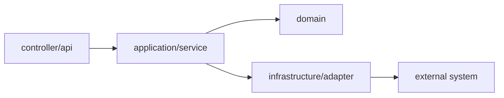
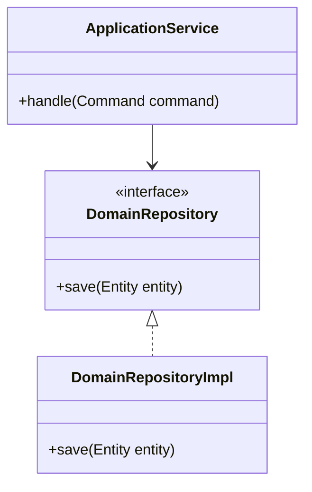
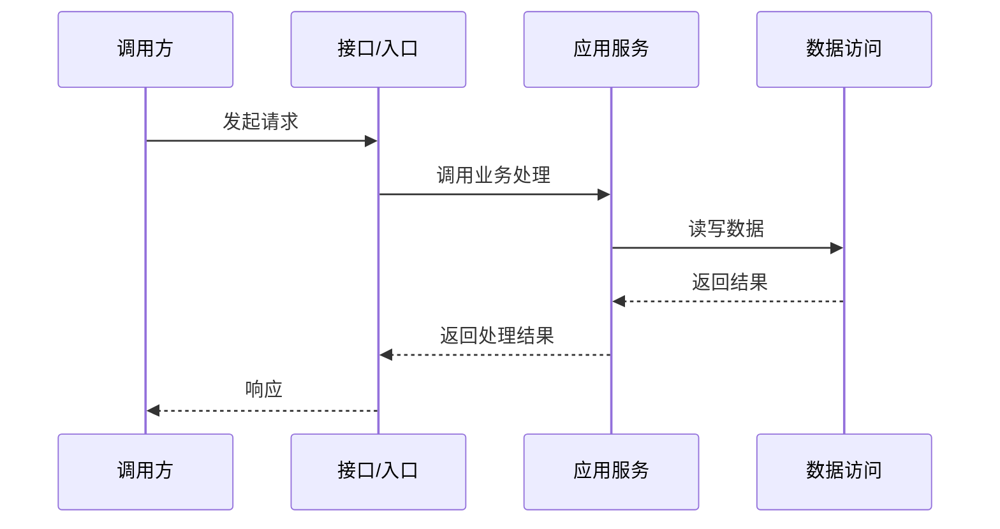

# 模块详细设计说明书 TOBE 正式模板

使用本模板更新当前 SDD 工作流指定的正式《{AR编号}-{需求短名}-{模块名}模块详细设计说明书.md》。正式说明书是指导开发的最后一道文档，也是后续 AICoding 的唯一开发依据；`.context.md` 只记录推导、证据和过程，不参与后续开发指导。

TOBE 不以章节数量判断质量，而以正式说明书是否能让人类快速审计、让 AI 直接开发、让门禁四链闭合判断质量。禁止将影响开发实现、接口契约、包/类设计、数据库、配置、调用流程、验证方式、风险控制或回退策略的内容只写入 `.context.md`。

## 1. 设计摘要

| 项目 | 内容 |
|---|---|
| 本次需求/AR/变更点 |  |
| 目标模块 |  |
| 运行模式 | 真实 / 演练 |
| 输出模式 | 轻量 / 标准 / 增强 |
| TOBE 状态 | 完成 / 部分完成 / 阻塞 |
| 是否可进入 AICoding | 是 / 否 / 仅限指定范围 |
| 关键设计结论 | 不超过 3 条 |
| 主要风险或阻塞 |  |
| 配套 context | `{同名前缀}.context.md` |

### 1.1 TOBE 变化触发表

| 变化类型 | 是否涉及 | 正式说明书展开位置 | 审计关注点 |
|---|---|---|---|
| 包/模块结构变化 | 是 / 否 | 5.1 | 是否越界、是否新增依赖、依赖方向是否正确 |
| 类/接口变化 | 是 / 否 | 5.2 | 抽象是否必要、职责是否清晰 |
| 业务流程变化 | 是 / 否 | 5.3 | 主链路、异常链路、状态变化是否闭合 |
| REST 接口变化 | 是 / 否 | 5.4 | 兼容性、鉴权、错误码、幂等 |
| Kafka/MQ 接口变化 | 是 / 否 | 5.4 | Topic、消息结构、幂等、重试、死信 |
| 内部 Java 接口/抽象变化 | 是 / 否 | 5.5 | 调用方向、方法签名、异常语义、扩展约束 |
| 数据库变化 | 是 / 否 | 5.6 | 表结构、索引、迁移、兼容、回滚 |
| 配置/开关变化 | 是 / 否 | 5.7 | 默认值、灰度、环境差异、关闭后行为 |

标记为“是”的变化类型必须在正式说明书中展开。标记为“否”的变化类型写一句不涉及原因即可，不生成空表。

### 1.2 TOBE 变更记录

| 轮次 | 变更来源 | 涉及章节/编号 | 变更摘要 | 影响任务/测试 | 是否需要门禁复检 |
|---|---|---|---|---|---|
| 第 1 轮 | 初版 / 门禁问题 / 用户反馈 / ASIS 回补 / 上游设计变化 |  |  | T1 / TEST1 | 是 / 否 |

## 2. 需求与范围

| 编号 | 需求/AR/变更点 | 本模块处理结论 | 关联 ASIS | 关联设计决策 |
|---|---|---|---|---|
| R1 |  | 本模块实现 / 本模块配合 / 不属于本模块 / 待确认 | A1 | D1 |

| 范围项 | 说明 |
|---|---|
| 纳入范围 |  |
| 排除范围 |  |
| 排除原因 |  |

## 3. 模块边界与职责

| 项目 | 内容 |
|---|---|
| `software_architecture.md` 边界 |  |
| 本模块承担 |  |
| 本模块不承担 |  |
| 交互模块 |  |
| 是否需更新上游设计/software_architecture.md | 是 / 否，原因： |

| 职责编号 | 职责描述 | 变化类型 | 需求/AR 编号 | ASIS 证据编号 | ASIS 结论状态 | 设计理由 |
|---|---|---|---|---|---|---|
| B1 |  | 保留 / 新增 / 修改 / 废弃 / 迁移 / 不属于本模块 | R1 | E1 | 事实 / 推断 / 待确认 / 阻塞相关 |  |

## 4. ASIS 事实与不确定性

只列会影响本次 TOBE 决策、任务或风险判断的 ASIS 事实，不复制完整 ASIS。

| ASIS 结论编号 | 结论状态 | ASIS 结论 | 证据编号 | 对 TOBE 的约束 | 是否阻塞 |
|---|---|---|---|---|---|
| A1 | 事实 / 推断 / 待确认 / 阻塞相关 |  | E1 |  | 是 / 否 |

## 4.1 关键设计变量表

对会跨章节重复出现的字段、DTO、接口、配置项、状态值、错误码、topic、path 和时间单位建立单点定义。后续摘要、图、表、任务、测试、风险章节必须复用本表口径。

| 变量编号 | 名称 | 类型/单位 | 序列化或外部名称 | 默认值/缺省语义 | 兼容策略 | 使用位置 |
|---|---|---|---|---|---|---|
| V1 |  |  |  |  |  | D1 / P1 / T1 / TEST1 |

## 5. TOBE 设计方案

### 5.1 包/模块结构设计

触发条件：新增包、移动职责、跨模块调用、引入 adapter/client/acl/service 等结构变化。未涉及时写明不涉及原因。

| 编号 | 包/模块 | 变化类型 | 职责 | 依赖方向 | 边界/防腐说明 | 关联决策 |
|---|---|---|---|---|---|---|
| PKG1 |  | 新增 / 调整 / 废弃 |  |  |  | D1 |

### 5.2 类与接口设计

触发条件：新增类、调整职责、抽象接口、策略类、适配器、领域对象、DTO/VO/Command/Event。未涉及时写明不涉及原因。

| 编号 | 类/接口 | 类型 | 职责 | 关键方法/字段 | 设计约束 |
|---|---|---|---|---|---|
| C1 |  | Class / Interface / AbstractClass / Enum / DTO / Adapter |  |  |  |

抽象类、Java interface、策略接口必须说明为什么需要；单实现且无扩展预期时优先普通 class。

### 5.3 业务流程设计

触发条件：主流程变化、状态变化、跨组件协作、异步处理、事务、回滚、异常路径。未涉及时写明不涉及原因。

#### 5.3.1 主流程

#### 5.3.2 异常与回退流程

| 场景 | 触发条件 | TOBE 行为 | 验证方式 | 回退策略 |
|---|---|---|---|---|
| F1 |  |  | TEST1 |  |

### 5.4 对外接口设计

触发条件：新增或修改 REST、OpenAPI、RPC、Kafka、MQ、Webhook、文件接口等。未涉及时写明不涉及原因。

#### 5.4.1 RESTful 接口

| 项目 | 内容 |
|---|---|
| 接口编号 | API1 |
| Method | GET / POST / PUT / DELETE / PATCH |
| Path |  |
| 认证/权限 |  |
| 幂等要求 | 是 / 否 |
| 兼容性 | 新增 / 兼容修改 / 破坏性修改 |
| 关联任务 | T1 |

##### 请求体

| 字段 | 类型 | 必填 | 约束 | 说明 |
|---|---|---|---|---|
|  |  | 是 / 否 |  |  |

##### 响应体

| 字段 | 类型 | 说明 |
|---|---|---|
|  |  |  |

##### 错误码

| 错误码 | HTTP 状态 | 触发条件 | 响应说明 |
|---|---|---|---|
|  |  |  |  |

#### 5.4.2 Kafka/MQ 接口

| 项目 | 内容 |
|---|---|
| 接口编号 | MSG1 |
| Topic/Queue |  |
| Producer / Consumer |  |
| 消息语义 | 事件 / 命令 / 通知 |
| Key 规则 |  |
| 幂等键 |  |
| 重试策略 |  |
| 死信策略 |  |
| 兼容策略 |  |
| 关联任务 | T2 |

##### 消息结构

| 字段 | 类型 | 必填 | 兼容要求 | 说明 |
|---|---|---|---|---|
|  |  | 是 / 否 |  |  |

### 5.5 内部接口与调用设计

触发条件：新增 service 方法、repository 方法、client 方法、Java interface、抽象类、SPI、策略扩展点。未涉及时写明不涉及原因。

| 接口编号 | 接口/方法 | 调用方 | 实现方 | 入参 | 出参 | 异常语义 | 关联决策 |
|---|---|---|---|---|---|---|---|
| INT1 | `Service.method(Command command)` |  |  |  |  |  | D1 |

#### 5.5.1 Java 抽象设计

| 编号 | 抽象类型 | 名称 | 设计目的 | 扩展点 | 约束 |
|---|---|---|---|---|---|
| ABS1 | Interface / AbstractClass |  |  |  |  |

### 5.6 数据库设计变化

触发条件：新增表、改字段、改索引、迁移、数据回填、读写语义变化。未涉及时写明不涉及原因。

#### 5.6.1 表结构变化

| 表 | 变化类型 | 字段/索引 | 变化说明 | 兼容策略 | 回滚策略 |
|---|---|---|---|---|---|
|  | 新增表 / 新增字段 / 修改字段 / 新增索引 / 删除字段 |  |  |  |  |

#### 5.6.2 字段设计

| 字段 | 类型 | 是否可空 | 默认值 | 约束 | 说明 |
|---|---|---|---|---|---|
|  |  | 是 / 否 |  |  |  |

#### 5.6.3 迁移与回填

| 迁移项 | 执行方式 | 数据影响 | 验证方式 | 回滚方式 |
|---|---|---|---|---|
|  | DDL / DML / 脚本 / 灰度 |  | TEST1 |  |

### 5.7 配置、开关与环境变化

触发条件：新增或修改配置、Feature Flag、环境变量、启动参数、灰度开关。未涉及时写明不涉及原因。

| 配置/开关 | 默认值 | 环境差异 | 灰度策略 | 关闭后行为 | 关联任务 |
|---|---|---|---|---|---|
|  |  |  |  | 保持 ASIS / 不适用 | T1 |

### 5.8 TOBE 设计决策

| 决策编号 | 设计点 | 类型 | 设计结论 | 设计理由 | 依赖 ASIS 证据 | 影响范围 | 是否定稿 |
|---|---|---|---|---|---|---|---|
| D1 |  | 新增 / 修改 / 复用 / 废弃 / 迁移 / 不做 |  |  | E1 | 文件/组件/接口/数据/配置 | 是 / 否，原因： |

### 5.9 可测定义

将影响验收的模糊质量词、事件触发条件和时效要求写成可测试定义；无此类内容时写明不适用。

| 术语或事件 | TOBE 定义 | 可观察信号 | 验证阈值或断言 | 关联任务/测试 |
|---|---|---|---|---|
| 及时 / 稳定 / 目录变更 / 高频 / 安全 |  | 日志 / 状态 / 返回值 / 文件变化 / 指标 |  | T1 / TEST1 |

## 6. 工程落点

| 落点编号 | 落点类型 | 位置 | TOBE 变化 | 兼容策略 | 回滚方式 | 关联决策 | ASIS 证据 |
|---|---|---|---|---|---|---|---|
| P1 | 文件 / 包 / 类 / 函数 / API / 数据 / 配置 / 开关 / 任务 |  |  |  |  | D1 | E1 |

位置尽量写到文件、类、函数、配置项、表或接口。如果暂时无法定位，必须写入“待确认与阻塞项”。

## 7. AICoding 任务与验证

### 7.1 AICoding 任务

| 任务编号 | 任务名称 | 任务粒度 | 主要改动区域 | 实现要点 | 依赖任务 | 最小验证集 | 验收标准 | 关联决策 | 关联需求/AR |
|---|---|---|---|---|---|---|---|---|---|
| T1 |  | 单入口 / 单行为 / 单主链路 | P1 |  | 无 | 测试文件/用例/命令 |  | D1 | R1 |

### 7.2 最小验证集

| 测试项 | 测试类型 | 关联任务 | 阶段性验证点 | 建议位置/命令 | 断言方式 | 执行顺序 |
|---|---|---|---|---|---|---|
| TEST1 | 单元 / 集成 / 契约 / 回归 / 迁移 / 兼容 / 性能 / 安全 / 日志可观测性 | T1 |  |  |  |  |

## 8. 风险、兼容与回退

只展开被触发且影响设计、验证或回退的风险专题；未触发的专题用一句话说明不适用原因。

| 风险编号 | 风险类型 | 风险描述 | 缓解策略 | 验证方式 | 回退策略 | 关联任务 |
|---|---|---|---|---|---|---|
| K1 | 架构 / 安全 / 性能 / 兼容 / 迁移 / 并发 / 日志可观测性 |  |  | TEST1 |  | T1 |

### 8.1 架构防腐化

| 边界/依赖 | 外部模型或协议 | 内部模型或职责 | 翻译位置 | 依赖方向 | 腐化风险 | 防护策略 | 验证方式 |
|---|---|---|---|---|---|---|---|
|  | DTO / SDK Model / API Payload / Event / Prompt Context |  | Adapter / Mapper / ACL / Service Boundary |  | 循环依赖 / 跨层调用 / 外部模型穿透 / 共享状态扩散 / 旁路写入 |  | TEST1 |

### 8.2 安全

| 项目 | 内容 |
|---|---|
| 分析强度 | 普通分析 / 增强分析 / 不适用 |
| 强度选择理由 |  |
| 增强触发项 | 无 / 支付 / 用户隐私 / 凭证密钥 / 权限边界 / 跨租户数据 / 外部输入 / 文件路径 / 命令执行 / 审计合规 / AI/LLM 上下文污染 / 高影响外部系统 |
| 设计结论 | 输入边界、权限、敏感信息、审计、脱敏、滥用场景、缓解措施和验证方式 |

### 8.3 性能

| 项目 | 内容 |
|---|---|
| 分析强度 | 普通分析 / 增强分析 / 不适用 |
| 强度选择理由 |  |
| 增强触发项 | 无 / 高频调用 / 批处理 / 大数据量 / 同步核心链路 / 启动路径 / 核心交易链路 / SLA 延迟目标 / 资源瓶颈 / 缓存降级变化 |
| ASIS 基线或现状估计 | 增强分析时必填；普通分析可按需填写 |
| 目标指标或 SLA | 增强分析时必填；无明确目标时说明 |
| 验证方法与回退策略 |  |

### 8.4 日志与可观测性

| 场景 | 追踪目标 | 关键字段 | 日志级别 | 密度控制 | 脱敏要求 | 验证方式 |
|---|---|---|---|---|---|---|
| 主流程 | 入口、关键判断和副作用可串联 | requestId / traceId / module / operation / result | info |  |  | TEST1 |
| 错误路径 | 能定位组件、依赖、错误类型和处理结果 | component / dependency / errorCode / action | warn / error | 聚合/采样 | 不输出密钥、Token、隐私数据、完整敏感路径 | TEST1 |

### 8.5 兼容、迁移与回滚

| 主题 | TOBE 策略 | 触发条件 | 验证方式 | 回滚方式 | 关联任务 |
|---|---|---|---|---|---|
| 接口兼容 / 数据兼容 / 配置兼容 / 迁移回填 / 回滚 |  |  | TEST1 |  | T1 |

### 8.6 并发、事务与幂等

| 主题 | TOBE 策略 | 不适用原因或风险 | 验证方式 | 关联任务 |
|---|---|---|---|---|
| 参数校验 / 异常处理 / 事务 / 并发控制 / 幂等 / 重试超时 / 降级补偿 |  |  | TEST1 | T1 |

## 9. 待确认与阻塞项

| 编号 | 类型 | 问题 | 影响 | 当前处理 | 需要谁确认 |
|---|---|---|---|---|---|
| Q1 | 待确认 / 需前置确认 / 阻塞 |  | 影响边界 / 影响方案 / 影响任务 / 影响验收 |  | 用户 / 上游设计 / 代码负责人 |

影响核心方案的问题必须标记 `需前置确认` 或 `阻塞`。不能一边写“待确认”，一边给出 AICoding 通过结论。

## `.context.md` TOBE 过程章节

以下内容写入同名前缀 `.context.md`，用于证明正式说明书中的 TOBE 如何形成，不作为后续开发依据。

## C7. TOBE 推导依据

| 决策编号 | 输入依据 | 推导过程摘要 | 被采纳原因 |
|---|---|---|---|
| D1 | R1 / A1 / E1 |  |  |

## C8. 替代方案与反证记录

| 编号 | 方案/反例 | 结论 | 未采纳或需整改原因 |
|---|---|---|---|
| ALT1 |  | 采纳 / 不采纳 / 待确认 |  |

## C9. 完整追踪矩阵

| 需求/AR | ASIS 结论 | 证据 | TOBE 决策 | 工程落点 | AICoding 任务 | 测试项 |
|---|---|---|---|---|---|---|
| R1 | A1 | E1 | D1 | P1 | T1 | TEST1 |
