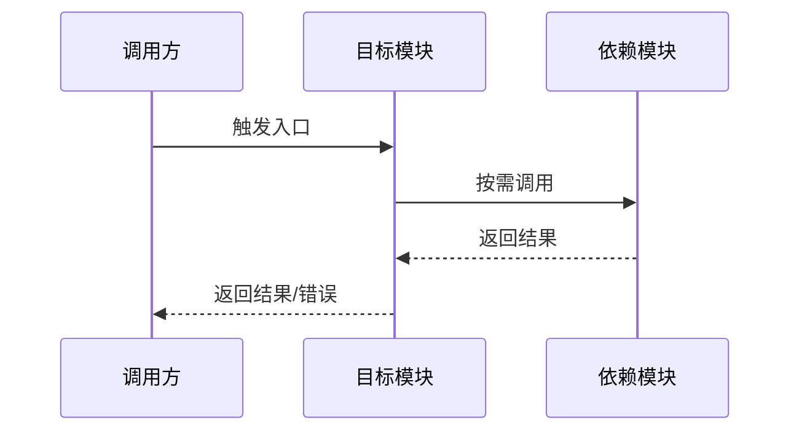

# 模块详细设计说明书 TOBE 核心骨架

使用本模板更新当前 SDD 工作流指定的模块详细设计类成果物。TOBE 产物不以章节数量判断质量，而以四条链是否闭合判断质量：证据链、边界链、执行链、风险链。

## 1. 设计摘要

| 项目 | 内容 |
|---|---|
| 本次需求/AR/变更点 |  |
| 目标模块 |  |
| 运行模式 | 真实 / 演练 |
| 输出模式 | 轻量 / 标准 / 增强 |
| TOBE 状态 | 完成 / 部分完成 / 阻塞 |
| 是否可进入 AICoding | 是 / 否 / 仅限指定范围 |
| 关键设计结论 |  |
| 主要风险或阻塞 |  |

### 1.1 输出控制

| 项目 | 内容 |
|---|---|
| 输出模式选择理由 |  |
| 合并或省略的章节 |  |
| 不适用项说明 |  |
| 增强输出触发项 | 无 / 高风险安全 / 高风险性能 / 跨模块 / 数据迁移 / 门禁返工 / ASIS 低置信度 / 其他 |

### 1.2 TOBE 变更记录

| 轮次 | 变更来源 | 修改章节/编号 | 修改摘要 | 影响任务/测试 | 是否需要门禁复检 |
|---|---|---|---|---|---|
| 第 1 轮 | 初版 / 门禁问题 / 用户反馈 / ASIS 回补 / 上游设计变化 |  |  | T1 / TEST1 | 是 / 否 |

## 2. 模块边界与职责

| 项目 | 内容 |
|---|---|
| `softWare.md` 边界 |  |
| 本模块承担 |  |
| 本模块不承担 |  |
| 交互模块 |  |
| 是否需更新上游设计/softWare.md | 是 / 否，原因： |

| 职责变化 | 职责描述 | 变化类型 | 需求/AR 编号 | ASIS 证据编号 | ASIS 结论状态 | 设计理由 |
|---|---|---|---|---|---|---|
|  |  | 保留 / 新增 / 修改 / 废弃 / 迁移 / 不属于本模块 | R1 | E1 | 事实 / 推断 / 待确认 / 阻塞相关 |  |

## 3. ASIS 事实与不确定性

只列会影响本次 TOBE 决策、任务或风险判断的 ASIS 事实，不复制完整 ASIS。

| ASIS 结论编号 | 结论状态 | ASIS 结论 | 证据编号 | 对 TOBE 的约束 | 是否阻塞 |
|---|---|---|---|---|---|
| A1 | 事实 / 推断 / 待确认 / 阻塞相关 |  | E1 |  | 是 / 否 |

## 4. TOBE 设计决策

| 决策编号 | 设计点 | 类型 | 设计理由 | 依赖 ASIS 证据 | 影响范围 | 是否定稿 |
|---|---|---|---|---|---|---|
| D1 |  | 新增 / 修改 / 复用 / 废弃 / 迁移 / 不做 |  | E1 | 文件/组件/接口/数据/配置 | 是 / 否，原因： |

### 4.1 可测定义

将影响验收的模糊质量词、事件触发条件和时效要求写成可测试定义；无此类内容时写明不适用。

| 术语或事件 | TOBE 定义 | 可观察信号 | 验证阈值或断言 | 关联任务/测试 |
|---|---|---|---|---|
| 及时 / 稳定 / 目录变更 / 高频 / 安全 |  | 日志 / 状态 / 返回值 / 文件变化 / 指标 |  | T1 / TEST1 |

## 5. 工程落点

| 落点类型 | 位置 | TOBE 变化 | 兼容策略 | 回滚方式 | 关联决策 | ASIS 证据 |
|---|---|---|---|---|---|---|
| 文件 / 包 / 类 / 函数 / API / 数据 / 配置 / 开关 / 任务 |  |  |  |  | D1 | E1 |

### 5.1 流程图或时序图

涉及多组件协作、跨模块交互、状态变化、写后读、异常路径或回滚时必须提供。简单单函数变更可写明不适用原因。

## 6. AICoding 任务与验证

| 任务编号 | 任务名称 | 任务粒度 | 主要改动区域 | 实现要点 | 依赖任务 | 最小验证集 | 验收标准 | 关联决策 | 关联需求/AR |
|---|---|---|---|---|---|---|---|---|---|
| T1 |  | 单入口 / 单行为 / 单主链路 |  |  | 无 | 测试文件/用例/命令 |  | D1 | R1 |

| 测试项 | 测试类型 | 关联任务 | 阶段性验证点 | 建议位置 | 断言方式 | 执行顺序 |
|---|---|---|---|---|---|---|
| TEST1 | 单元 / 集成 / 契约 / 回归 / 迁移 / 兼容 / 性能 / 安全 / 日志可观测性 | T1 |  |  |  |  |

## 7. 风险专题设计

只展开被触发的风险专题；未触发的专题用一句话说明不适用原因。

### 7.1 架构防腐化

| 边界/依赖 | 外部模型或协议 | 内部模型或职责 | 翻译位置 | 依赖方向 | 腐化风险 | 防护策略 | 验证方式 |
|---|---|---|---|---|---|---|---|
|  | DTO / SDK Model / API Payload / Event / Prompt Context |  | Adapter / Mapper / ACL / Service Boundary |  | 循环依赖 / 跨层调用 / 外部模型穿透 / 共享状态扩散 / 旁路写入 |  |  |

### 7.2 安全

| 项目 | 内容 |
|---|---|
| 分析强度 | 普通分析 / 增强分析 / 不适用 |
| 强度选择理由 |  |
| 增强触发项 | 无 / 支付 / 用户隐私 / 凭证密钥 / 权限边界 / 跨租户数据 / 外部输入 / 文件路径 / 命令执行 / 审计合规 / AI/LLM 上下文污染 / 高影响外部系统 |
| 普通分析结论 | 输入边界、权限、敏感信息、审计和脱敏结论 |
| 增强分析补充 | 攻击面、数据分级、信任边界、滥用场景、缓解措施和验证方式 |

### 7.3 性能

| 项目 | 内容 |
|---|---|
| 分析强度 | 普通分析 / 增强分析 / 不适用 |
| 强度选择理由 |  |
| 增强触发项 | 无 / 高频调用 / 批处理 / 大数据量 / 同步核心链路 / 启动路径 / 核心交易链路 / SLA 延迟目标 / 资源瓶颈 / 缓存降级变化 |
| ASIS 基线或现状估计 | 增强分析时必填；普通分析可按需填写 |
| 目标指标或 SLA | 增强分析时必填；无明确目标时说明 |
| 负载估算方法 | 增强分析时必填 |
| 验证方法与回退策略 |  |

### 7.4 日志与可观测性

| 场景 | 追踪目标 | 关键字段 | 日志级别 | 密度控制 | 脱敏要求 | 验证方式 |
|---|---|---|---|---|---|---|
| 主流程 | 入口、关键判断和副作用可串联 | requestId / traceId / module / operation / result | info |  |  |  |
| 错误路径 | 能定位组件、依赖、错误类型和处理结果 | component / dependency / errorCode / action | warn / error | 聚合/采样 | 不输出密钥、Token、隐私数据、完整敏感路径 |  |
| 高频/批量路径 | 观察规模、耗时、失败数量和降级状态 | batchSize / duration / successCount / failureCount / degraded | debug / info | 仅输出批次摘要或采样摘要 |  |  |

### 7.5 兼容、迁移与回滚

| 主题 | TOBE 策略 | 触发条件 | 验证方式 | 回滚方式 | 关联任务 |
|---|---|---|---|---|---|
| 接口兼容 / 数据兼容 / 配置兼容 / 迁移回填 / 回滚 |  |  |  |  | T1 |

### 7.6 并发、事务与幂等

| 主题 | TOBE 策略 | 不适用原因或风险 | 验证方式 | 关联任务 |
|---|---|---|---|---|
| 参数校验 / 异常处理 / 事务 / 并发控制 / 幂等 / 重试超时 / 降级补偿 |  |  |  | T1 |

## 8. 门禁结果与待确认

| 类型 | 编号 | 描述 | 影响 | 下一步 |
|---|---|---|---|---|
| 阻塞 / 需前置确认 / 待确认 / 非阻断改进 |  |  | 对 TOBE/AICoding 的影响 | 立即问询用户/上游负责人 / 回 ASIS / 回 TOBE / 上游确认 / 可进入 AICoding |
